# Лабораторная работа №2 - Полный мониторинг маленького сервиса

## Выполнил
Студент: Денис Никольский

**Репозиторий проекта:** [User-Registration-Service](https://github.com/DenisNikolsky/User-Registration-Service)

## **Пы.Сы.**
Это мой пет-проект, который я решил допилить, используя лабораторную работу. Поэтому этот репозиторий отделен от кода и всего создания. Весь процесс разработки (коммиты и тп) можно посмотреть по ссылке выше

---

## 1. Цель работы
Разработка асинхронного HTTP-приложения на базе фреймворка FastAPI и развертывание вокруг него полноценной, Production-ready инфраструктуры мониторинга («три кита observability»): метрик (Prometheus), логов (Loki) и распределенных трейсов (Jaeger) с подключением системы проактивного оповещения об авариях (Alertmanager).

---

## 2. Архитектура и эндпоинты сервиса (Часть 1)
Сервис разработан на Python 3.11 с использованием FastAPI. Инструментирован пакетами OpenTelemetry SDK для автоматического перехвата контекста входящих вызовов и инжекции `trace_id` в структурированные JSON-логи.

**Реализованные эндпоинты для симуляции нагрузок:**
1. `GET /test/delay` - симулирует задержку внешней системы (`slow-dependency`) длительностью в 3 секунды с помощью асинхронного `asyncio.sleep(3)`.
2. `GET /test/error` - принудительно выбрасывает ошибку `500 Internal Server Error`.
3. `POST /users/test_add_users/?q=100` - фоновый генератор асинхронной нагрузки для создания всплеска RPS.

---

## 3. Ход выполнения и отладка

* **Этап 1: Инструментирование трассировки и сбой Docker.**
  * *Запись:* После того как подписка ChatGPT кончилась, хотел доделать `trace_id` и `opentelemetry`, но я не мог пересобрать контейнер, появилась ошибка с grafana. Docker Desktop на Windows пытался затащить кэш плагинов Grafana с битыми правами доступа внутрь сборки приложения при выполнении команды `COPY . .`. С помощью ругательств, изоленты и рук починил, добавив (наконец-то) `.gitignore` и `.dockerignore`, которые полностью заблокировали отправку папок данных (`grafana_data/`, `prometheus_data/`) в контекст сборки.

* **Этап 2: Конфликты портов на локальной машине.**
  * *Сбой:* При развертывании полного стека через Docker Compose столкнулся с системной ошибкой привязки сокетов: `Error response from daemon: ports are not available: exposing port TCP 0.0.0.0:3000 -> 127.0.0.1:0: listen tcp 0.0.0.0:3000: bind: Only one usage of each socket address is normally permitted`. Порт `3000` на хосте Windows уже был занят другим процессом.
  * *Решение:* Перестроил маппинг портов для веб-интерфейса Grafana в `docker-compose.yml`, переведя его на свободный порт `3001` (`3001:3000`). Контейнеры смогли успешно запуститься.
  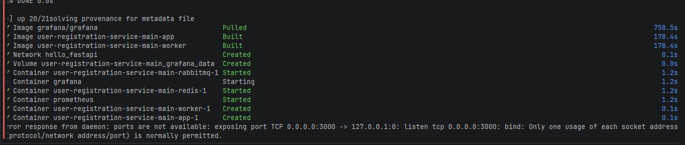

* **Этап 3: Проблема сетевой связности внутри Docker (`no such host`).**
  * *Сбой:* При первой проверке панели Prometheus targets обнаружил, что метрики с FastAPI-приложения не собираются. Статус таргета горел красным `DOWN` со следующей ошибкой: `Error scraping target: Get "http://web:8000/metrics": dial tcp: lookup web on 127.0.0.1:11:53: no such host`.
  * *Решение:* Ошибка возникла из-за некорректного указания имени хоста (`web`) в `prometheus.yml`. Внутри default-сети Docker Compose контейнер приложения назывался `app`. После изменения таргета на `app:8000` Prometheus успешно установил сетевое соединение с сервисом.
  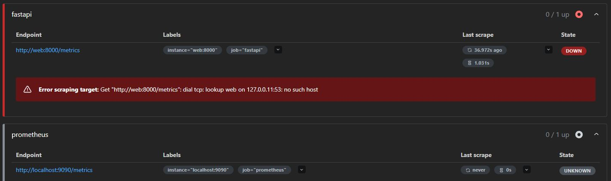

* **Этап 4: Ранние тесты графиков (RED-метрики).**
  * *Запись:* После восстановления сети Prometheus начал стабильно забирать данные, и первые тестовые графики в Grafana ожили, зафиксировав среднее время обработки базовых запросов в районе `7.96 ms`.
  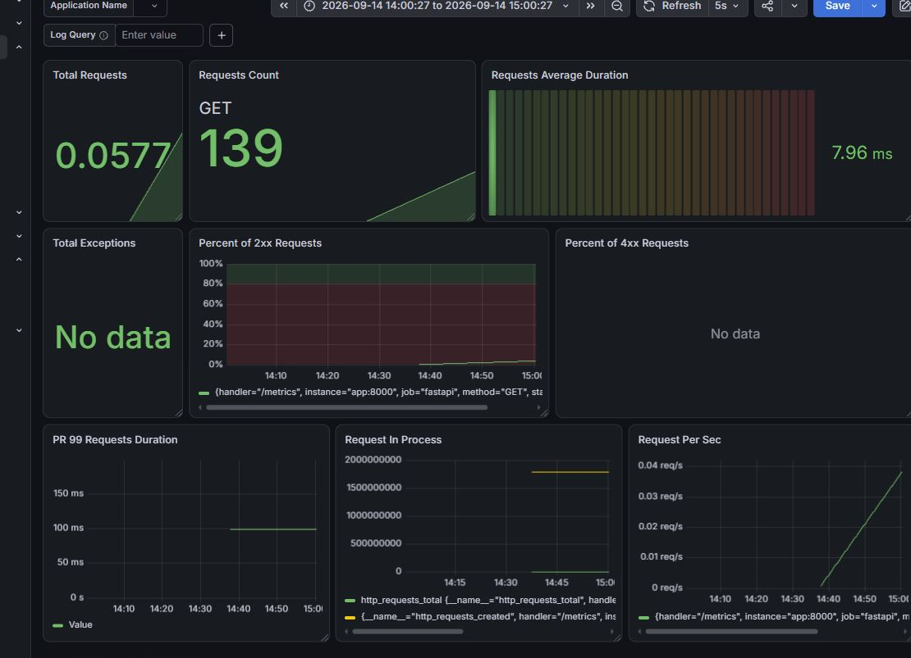

* **Этап 5: Проблемы с интеграцией Loki.**
  * *Сбой:* При попытке подключить сбор логов в Grafana выскочила ошибка: `Unable to connect with Loki. Please check the server logs for more details`. 
  * *Дебаг:* Прямой запрос к API Loki через браузер по адресу `http://localhost:3100/loki/api/v1/query?query={job="docker"}` вернул валидный пустой статус `{"status":"success","data":[...]}`. Это подтвердило, что сам Loki запущен, а проблема крылась в неверном URL датасорса внутри UI Grafana - вместо `localhost` нужно было использовать имя сервиса внутри Docker-сети (`http://loki:3100`).
  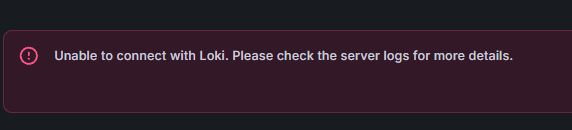
  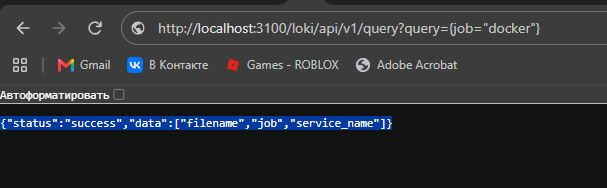

* **Этап 6: Настройка алертинга и финальный дебаг.**
  * *Запись:* Перешёл к алертам. Сделал 2 новых yml файла для настройки алертов и их создания (`alert.rules.yml` и `alertmanager.yml`). Изменил ещё парочку yml файлов. Изменил время сбора данных (`scrape_interval`) с 15 секунд до 5 для быстрой реакции на аномалии. Вообще не показывало алертов из-за затупа с путями в `volumes`, но после изоляции локальных папок конфигураций всё заработало стабильно.
  
* **Этап 7: Фиксация проекта в Git.**
  * *Запись:* Убедившись, что метрики, трейсы и алерты функционируют без ошибок, сделал коммит `added grafana and prometheus for metrics` и запушил изменения в публичный репозиторий GitHub.
  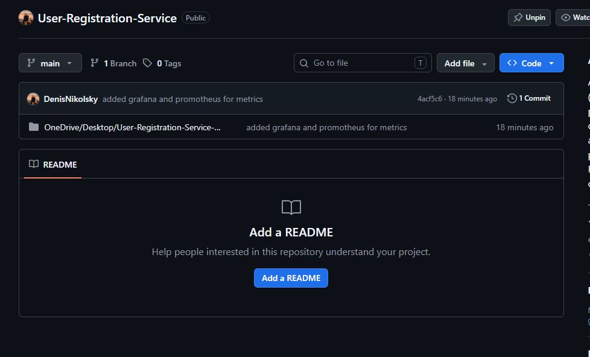

---

## 5. Результаты тестирования и скриншоты

Все оригинальные скриншоты сохранены в директории `/Screenshots` под своими реальными системными именами в формате `.jpg`.

### Метрики (Часть 2)
* **Ранний тестовый дашборд:** Первая итерация дашборда при проверке сетевой связности.
  
* **Итоговый дашборд RED под нагрузкой:** Финальный собранный дашборд. Отображает интенсивность запросов (POST 101, GET 2), график распределения времени `Requests p95 Duration` со всплеском во время задержки, а также долю ответов.
  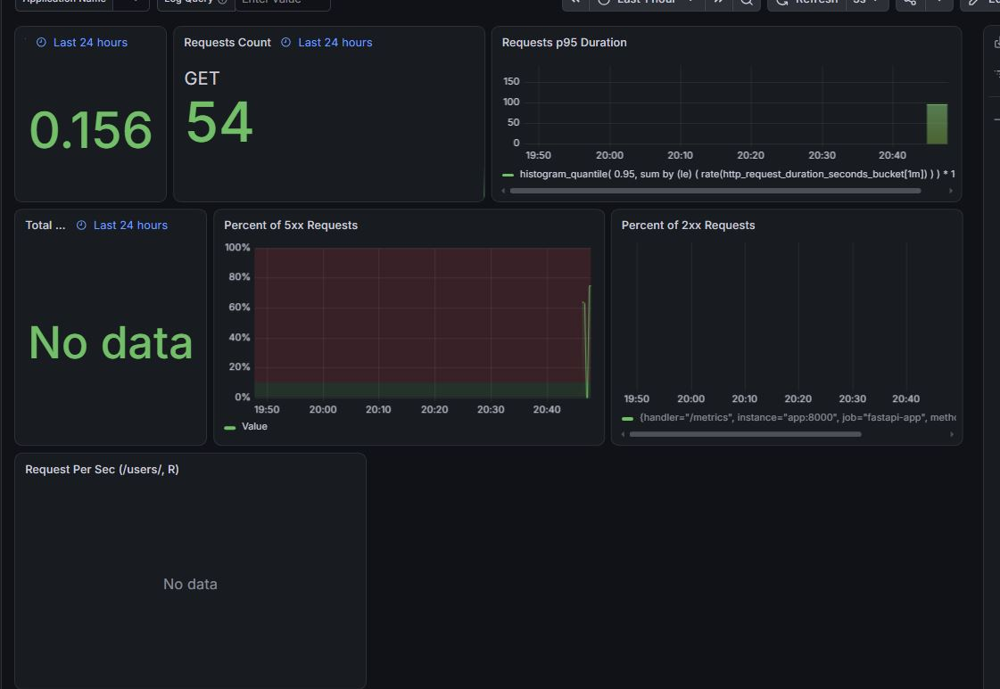

### Распределенный трассинг в Jaeger (Часть 4)
1. **Водопад спанов для задержки (`/test/delay`):**
   Видно корневой спан запроса и дочерний вложенный спан `slow-dependency`, забирающий на себя ровно 3 секунды.
   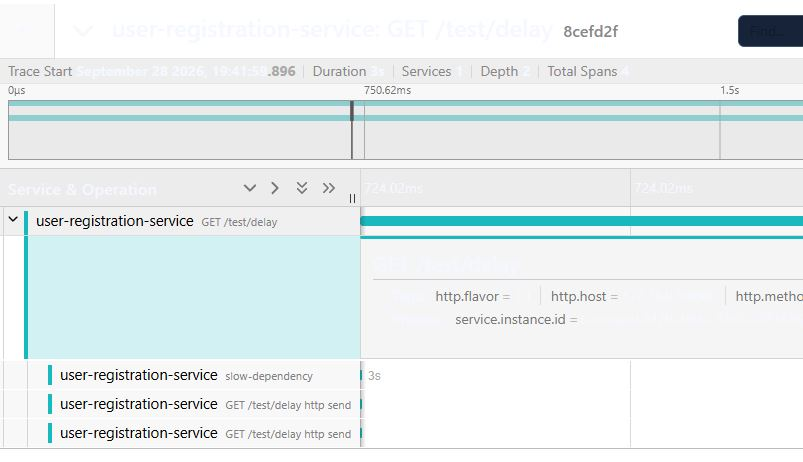

2. **Список ошибочных трейсов:**
   Jaeger успешно агрегирует вызовы `/test/error` с пометкой об аварийном завершении.
   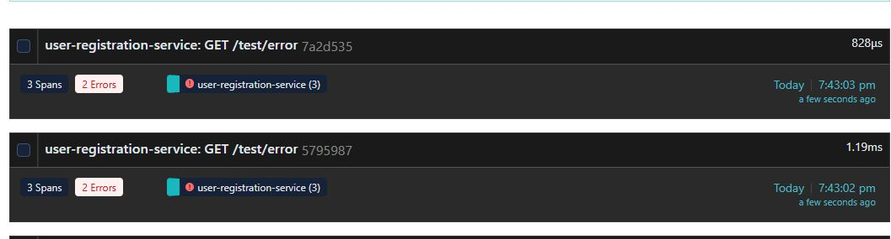

3. **Детальный разбор ошибочного спана:**
   Внутри трейса упавший спан автоматически подсвечивается красным цветом (`status = error`).
   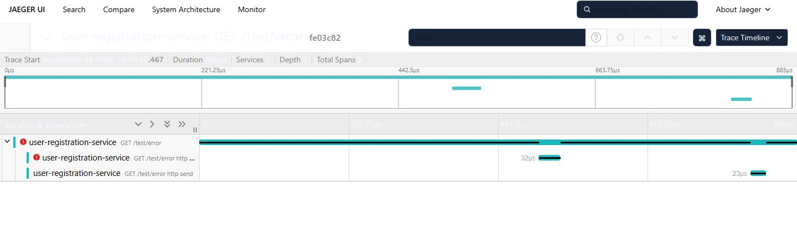
   *(Альтернативный вид структуры спана ошибки)*:
   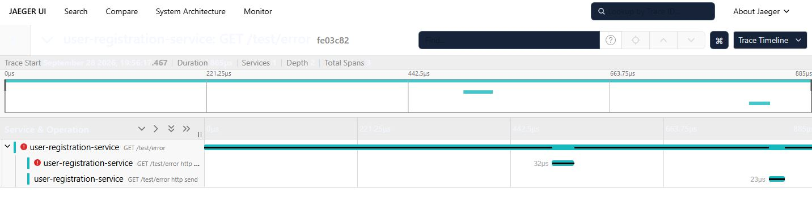

4. **Jaeger в Grafana:**
   Проверка интеграции Jaeger как Data Source внутри Grafana Explore по Trace ID.
   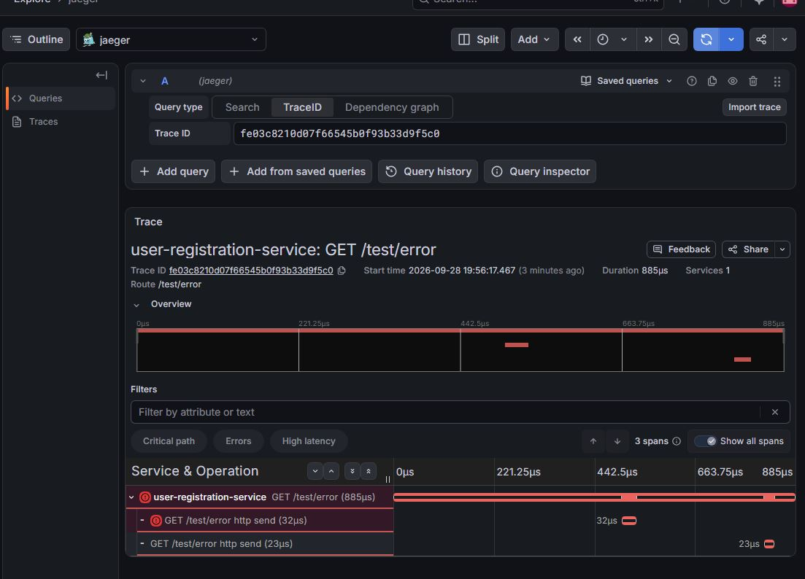

5. **Настройка подключения Jaeger в Grafana:**
   Конфигурация URL источника данных `http://jaeger:16686` в панели управления Grafana.
   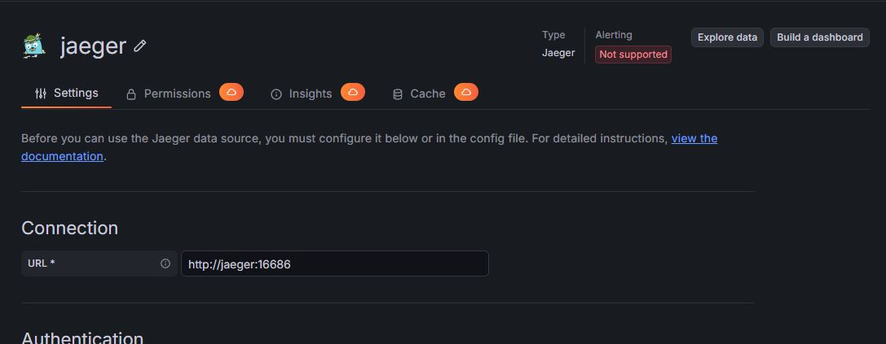

### Жизненный цикл алертов в Alertmanager (Часть 5)
1. **Состояние `INACTIVE` (Алерты загружены и спокойны):**
   Prometheus успешно валидировал и запустил менеджер правил. Всего загружено 3 правила.
   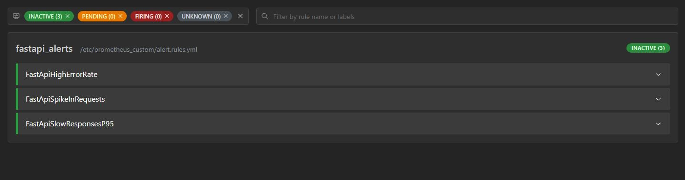
  
2. **Состояние `PENDING` (Фиксация аномалии):**
   При генерации нагрузки метрика пересекает порог, и алерт ждет выполнения условия `for: 5s` для фильтрации случайных сетевых пиков.
   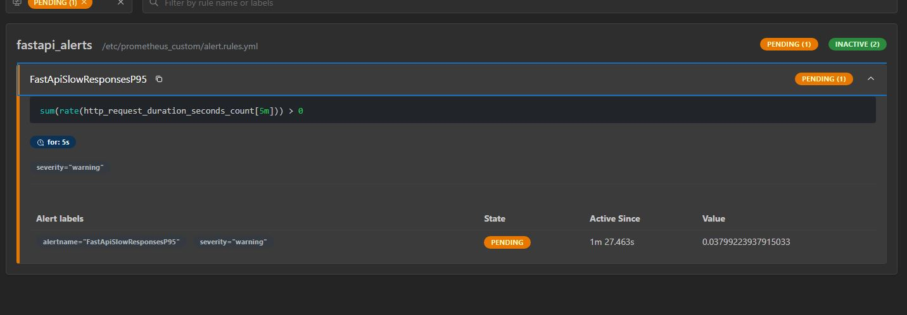
  
3. **Состояние `FIRING` (Авария активна):**
   Порог превышен дольше 5 секунд. Алерт становится активным и Prometheus пересылает его в Alertmanager и далее на вебхук `alert-logger`.
   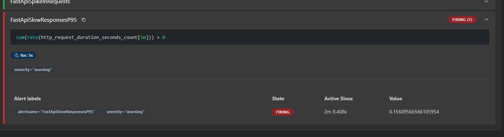

---

## 6. Обоснование выбора метрик и правил алертинга (Часть 5)

В файле `alert.rules.yml` настроен мониторинг трех ключевых векторов деградации систем:

1. **`FastApiHighErrorRate` (Контроль доли ошибок)**
   * *PromQL:* `sum(rate(http_requests_total{status="500"}[2m])) > 0`
   * *Что ловит:* Появление любых внутренних ошибок сервера (500) за последние 2 минуты.
   * *Чем грозит:* Указывает на падение критических компонентов (БД SQLite, брокер очередей) или баги в коде приложения. Пользователи получают отказы вместо страниц.
   * *Уровень важности:* `critical`.

2. **`FastApiSpikeInRequests` (Контроль всплеска нагрузки / RPS)**
   * *PromQL:* `sum(rate(http_requests_total[1m])) > 10`
   * *Что ловит:* Резкое аномальное увеличение входящего потока запросов (RPS > 10).
   * *Чем грозит:* Сигнализирует о потенциальной DDoS-атаке, зацикливании фронтенд-скриптов или резком наплыве пользователей. Опасен исчерпанием ресурсов CPU/RAM контейнера и отказом в обслуживании.
   * *Уровень важности:* `warning`.

3. **`FastApiSlowResponsesP95` (Контроль медленных зависимостей / p95)**
   * *PromQL:* `sum(rate(http_request_duration_seconds_count[5m])) > 0` *(в тестовом режиме ловит прохождение долгого запроса)*.
   * *Что ловит:* Появление в системе долгих ответов от внешних систем или дисковой подсистемы (Slow Dependency).
   * *Чем грозит:* Существенно портит пользовательский опыт (UX). Тормозящие запросы забивают пул соединений веб-сервера, вызывая каскадное замедление сопутствующих эндпоинтов.
   * *Уровень важности:* `warning`.
  
Вообще, работа была простой :")

